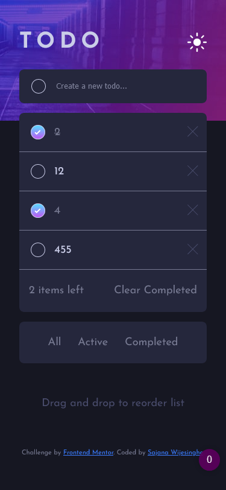

# Frontend Mentor - Todo app solution

This is a solution to the [Todo app challenge on Frontend Mentor](https://www.frontendmentor.io/challenges/todo-app-Su1_KokOW). Frontend Mentor challenges help you improve your coding skills by building realistic projects. 

## Table of contents

- [Overview](#overview)
  - [The challenge](#the-challenge)
  - [Screenshot](#screenshot)
  - [Links](#links)
- [My process](#my-process)
  - [Built with](#built-with)
  - [Continued development](#continued-development)
- [Author](#author)

## Overview

### The challenge

Users should be able to:

- View the optimal layout for the app depending on their device's screen size
- See hover states for all interactive elements on the page
- Add new todos to the list
- Mark todos as complete
- Delete todos from the list
- Filter by all/active/complete todos
- Clear all completed todos
- Toggle light and dark mode  --- There is an issue that i'll fix in a later version
- **Bonus**: Drag and drop to reorder items on the list  --- TO BE COMPLETED

### Screenshot

#### Desktop View

##### Desktop View Dark Theme

##### Desktop View Light Theme

#### Mobile View

##### Mobile View Dark Theme

##### Mobile View Light Theme

### Links

- Solution URL: [https://github.com/StormKing969/ToDo-App](https://github.com/StormKing969/ToDo-App)
- Live Site URL: [https://todo-remainder-app.herokuapp.com/](https://todo-remainder-app.herokuapp.com/)

## My process

### Built with

- Semantic HTML5 markup
- Mobile-first workflow
- Flexbox
- Node JS
- Express JS
- MongoDB
- Mongoose
- SCSS custom properties

### Continued development

While I feel a lot more comfortable using Node JS and MongoDB to store my data. I feel like I should try using them in a lot more complex project to feel like I completely understood the concept.

## Author

- Website - [Sajana Wijesinghe](https://sajana-wijesinghe.com/)
- Frontend Mentor - [@StormKing969](https://www.frontendmentor.io/profile/StormKing969)